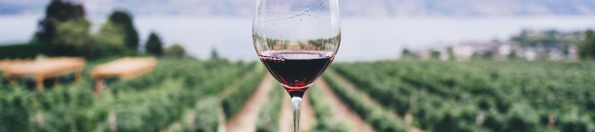
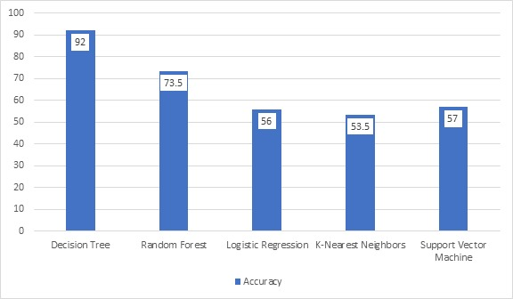

# WINE QUALITY PREDICTION:

## Objective :

The dataset contains different chemical information about wine. It has 1600 instances with 12 variables. The dataset is beginner friendly for classification and regression tasks. The model can be used to predict wine quality.

## Features :

- Two types of variables are there in the dataset, i.e., input and output variables.
- Input variables are fixed acidity, volatile acidity, citric acid, residual sugar, and so forth.
- The output variable is quality.
- 12 attributes are present.
- The number of total records is 1600.

## Algorithms Analyzed :

1. ID3 Algorithm (Decision Tree)
2. Random Forest
3. Logistic Regression
4. K-Nearest Neighbors
5. Support Vector Machine

## Inference :

| S.No. | Algorithm implemented  | Accuracy (in %) |
| ----- | ---------------------- | --------------- |
| 1     | Decision Tree          | 91.57 %         |
| 2     | Random Forest          | 73.43 %         |
| 3     | Logistic Regression    | 55.90 %         |
| 4     | K-Nearest Neighbors    | 53.43 %         |
| 5     | Support Vector Machine | 57.18 %         |

> The accuracy is highest for **Decision Tree algorithm** with **91.56%** and is best to classify the given data set.

## Results :

> Presntation Link : [Click Here](https://docs.google.com/presentation/d/1HPokI8aAs1ntUwofjAbzkyw99P-W5g_33PK_SmDbpto/edit?usp=sharing)

> Dataset : [Click Here](./winequality-red.csv)

> Notebook : [Click Here](./Machine_Learning_Project.ipynb)

> Kaggle : [Click Here](https://www.kaggle.com/gudivaraprasad/wine-quality-prediction-ml-project)
> 
> 
