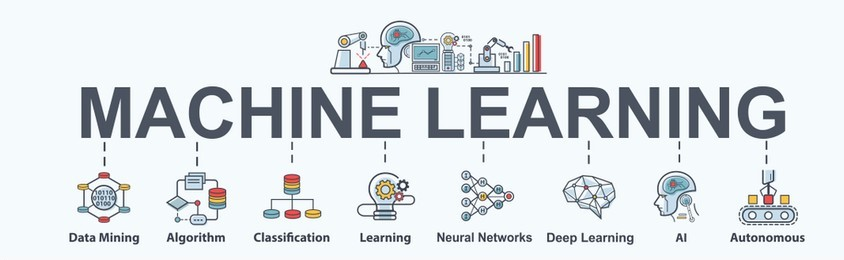

# MACHINE LEARNING:

## Algorithms Implemented:

1. Find-S Algorithm
2. Candidate Elimination Algorithm
3. ID3 Algorithm (Decision Tree)
4. Random Forest
5. Linear Regression
6. Logistic Regression
7. K-Nearest Neighbors
8. Linear SVM
9. Non-linear SVM
10. SVM Multiclass (OVA, OVO)
11. Naive Bayes
12. Artificial Neural Networks

> [Mini Project](./MiniProject/)

> [LAB VIVA Questions](./VIVA.pdf)

> _Also Credits to Google, Medium, AnalyticsVidya, towardsdatascience, Github_
